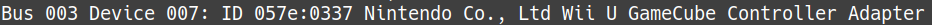
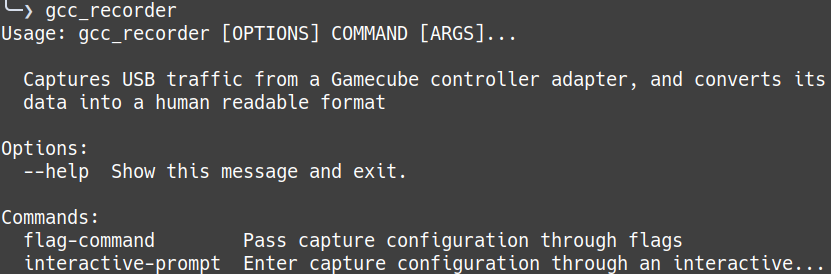
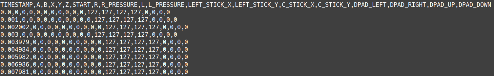

# GameCube Controller Recorder

---

Captures USB traffic from a GameCube-to-USB adapter.

---

## Description

This application reads the stream of USB packets sent by a GameCube controller to a computer through any compliant adapter (such as the official Nintendo adapter), and records it to a CSV file.

Each recorded packet represents data polled from the controller, in other words the player's actions at that instant. So this software is useful whenever reviewing or replaying past actions is important, such as the following cases :

- Checking if and when actions were performed, to confront with actual outcomes ("Did I press A at the correct timing?")
- Record and share capture files as "macros", to define a repeatable pattern for practice, for example.
  - Note : This program doesn't include replay functions for capture files.
- Record actual games, for analysis or replay purpose.
  - Note : Multi-port recording isn't available yet.

Other nice things :

- Record controller inputs while playing **ANY** game, independently of their internal memory mapping or game state.
- Pure software solution, no need for hardware mods on the controller or adapter.

Right now, this software admittedly has little use. The project's goal is to build a common data framework for controller inputs, in order to facilitate other projects on the same topic.

As the project is still young, don't hesitate to provide suggestions or feedback in issues.

---

## Install

**IMPORTANT** : As of now, only Linux is supported, due to reliance on `usbmon` module to intercept USB data.

This application requires **PyPy** interpreter to launch. Default Python interpreter **CPython** is unsupported, and will likely produce unexpected results because multi-threading is actively used in the code.

To install PyPy :

- Follow instructions on the [official website](https://www.pypy.org/download.html), or
- (Recommended) Use a version manager like [pyenv](https://github.com/pyenv/pyenv) or [asdf](https://github.com/asdf-vm/asdf) to manage it alongside default Python interpreters.

Once PyPy is installed, run the following command to install the project's package, preferrably in a virtual environment :

`pypy -m pip install gcc_recorder`

---

## How to use

---

### Pre-requisites

1) Plug your GameCube adapter and controller as usual.

2) Activate `usbmon` module with :

`sudo modprobe usbmon`

3) Find under which USB bus and device number your GameCube adapter is registered, using :

`lsusb̀`

Example output

Here, the adapter is registered as device **7**, connected to USB bus **3**

4) Start a game or software using the GameCube controller to begin polling with your computer.

5) Open a terminal and run `gcc_recorder` to see command-line help :

---

### Features

Two options are available to run the application.

`interactive_prompt` : The program will ask for required information through the terminal. Easiest to use.

`flag_command` : Use traditional flags to send input to the program (use `-h/--help` option for the full list). Fastest when repeating similar configurations.

In both cases, the application will start recording for a certain duration the data sent by the controller. Once the terminal indicates that capture has started, simply use the controller as usual. After that, end of capture and end of program are both notified with a terminal message each.

Once the program has finished, your output CSV file should look like this :

Here's a breakdown of each data point's meaning :

- TIMESTAMP : Time (in seconds) at which the packet was received, relative to the 1st packet received at time 0. Precision goes to 6 digits max.
- A, B, X, Y, Z, START, DPAD\_LEFT, DPAD\_RIGHT, DPAD\_UP, DPAD\_DOWN : 0 in neutral state, 1 if button was pressed.
- R, L : 0 in neutral state, 1 if digital trigger button was pressed.
- R\_PRESSURE, L\_PRESSURE : Value of analog trigger press, between 0 and 255.
- LEFT\_STICK\_X, LEFT\_STICK Y : Coordinates of the left gray stick on the X and Y axis, between 0 and 255.
- C\_STICK\_X, C\_STICK\_Y : Coordinates for the C-Stick on the X and Y axis, between 0 and 255.

---

## License

GNU General Public License v3.0, see LICENSE file for the full text.
